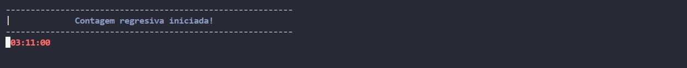
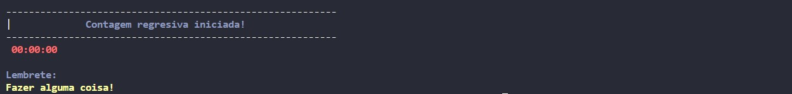

# timer-em-python

#### Com este script todo feito em Python, você pode iniciar um timer adicionando horas, minutos e segundos e ainda poderá colocar um lembrete para que assim que o "timer" chegue ao fim o lembrete seja mostrado!

## screenshots

_Recebendo os dados do usuário._

_Mostrando os dados para o usuário._

## Author

[Paulo Daniel](https://www.linkedin.com/in/paulodaniel-oficial)
